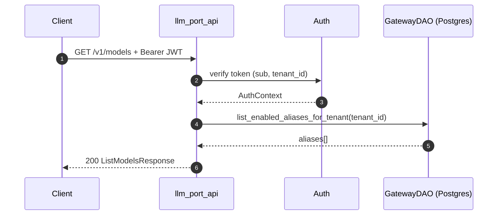
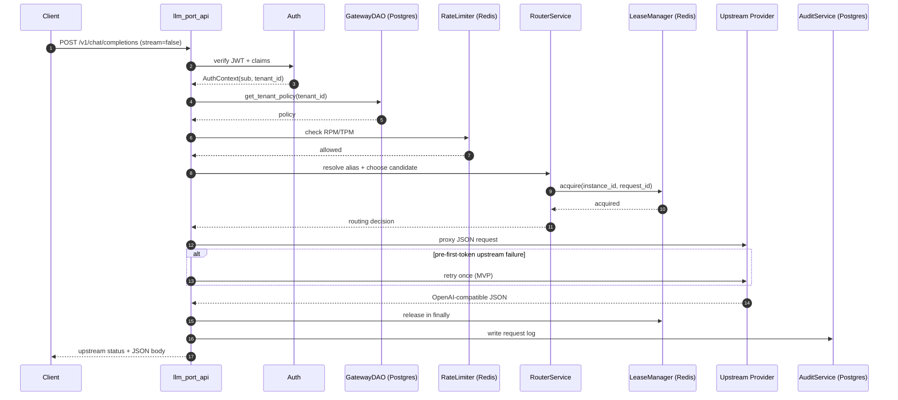
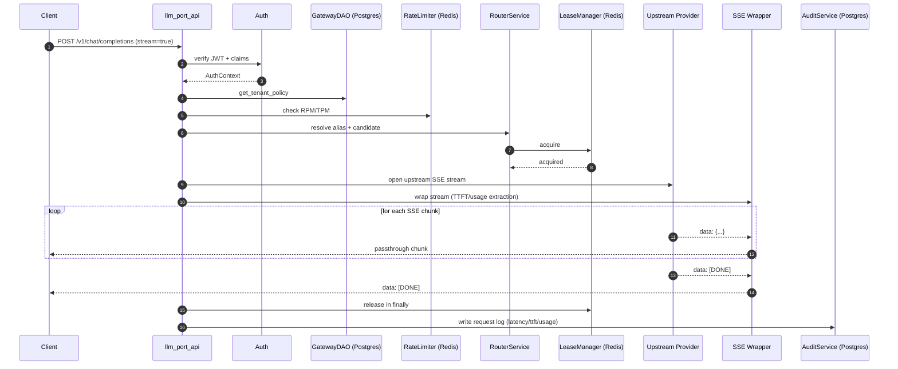
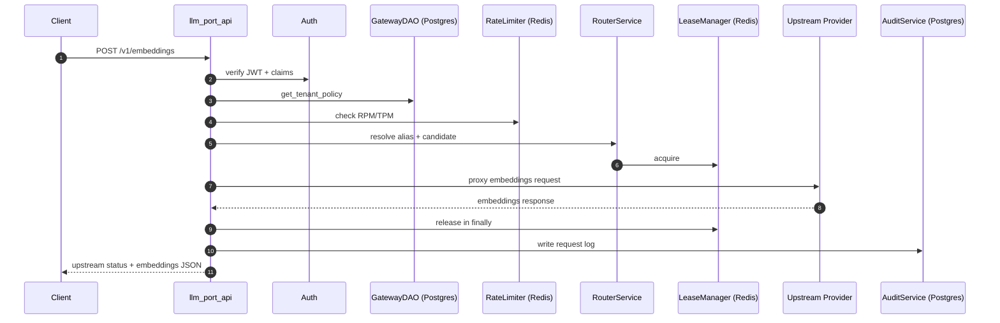

# API Sequence Diagrams

This document describes request/response flow for the OpenAI-compatible gateway endpoints.

## `/v1/models`



## `/v1/chat/completions` (non-stream)



## `/v1/chat/completions` (stream)



## `/v1/embeddings`



## Error Envelope

All endpoint failures are returned in OpenAI-compatible shape:

```json
{
  "error": {
    "type": "invalid_request_error",
    "message": "Human readable message",
    "param": null,
    "code": "machine_readable_code"
  }
}
```
