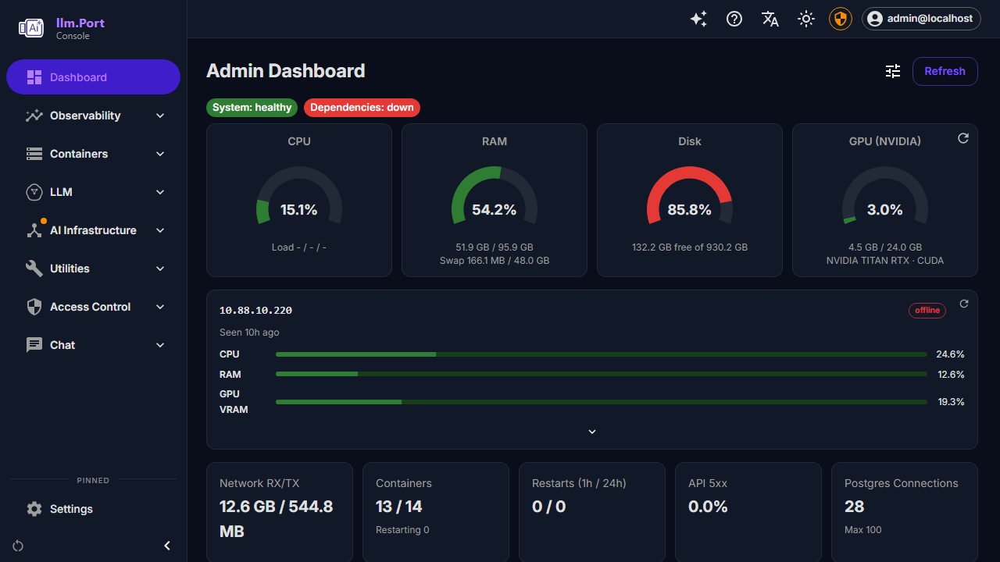
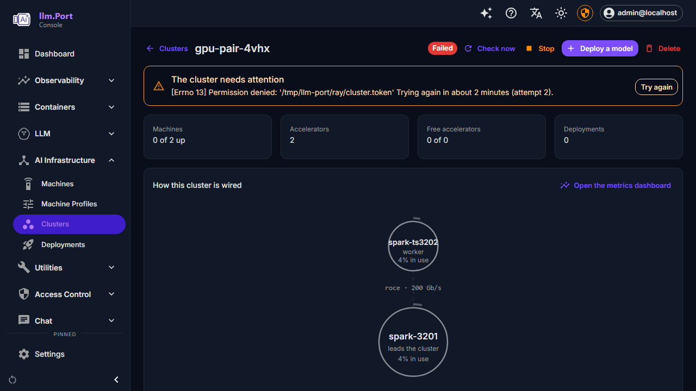
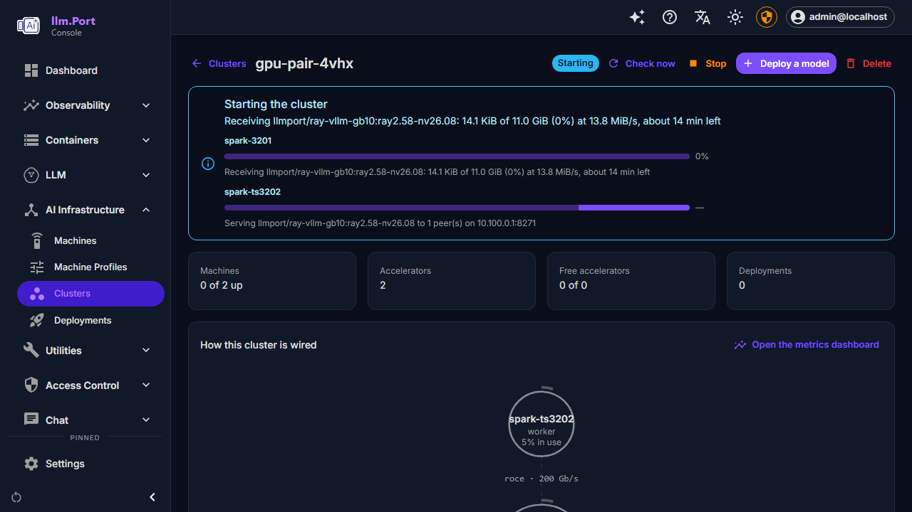
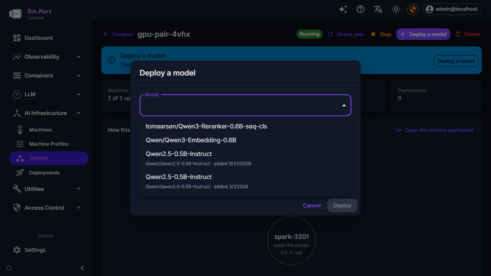
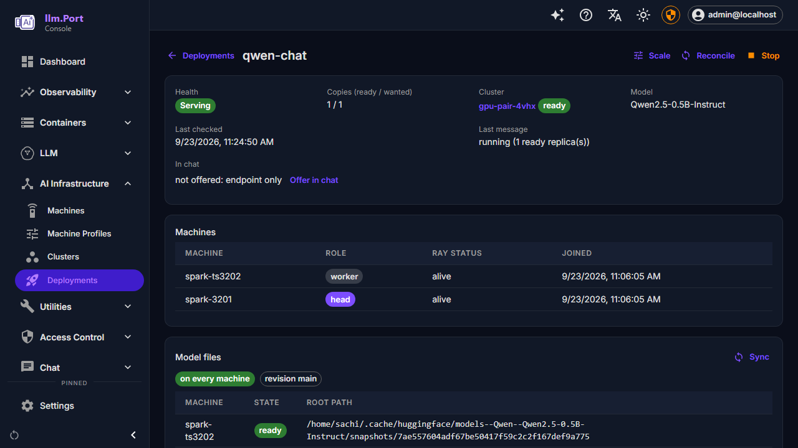
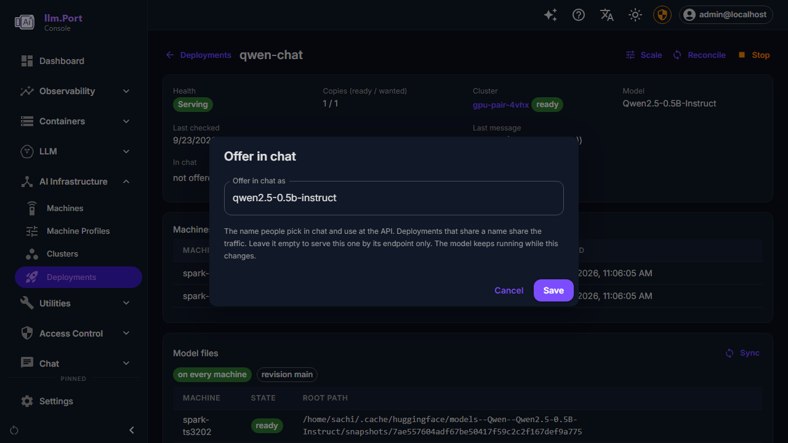
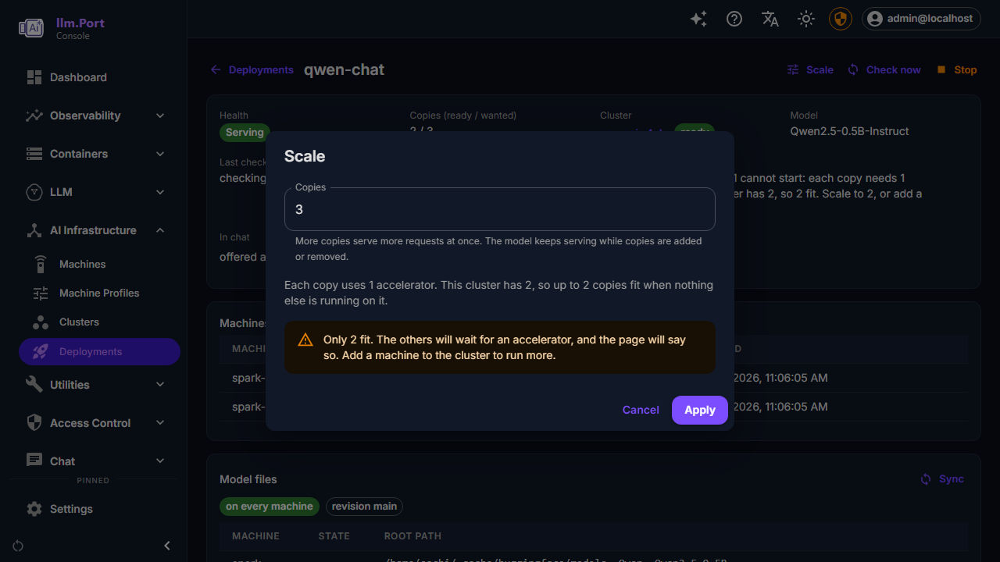
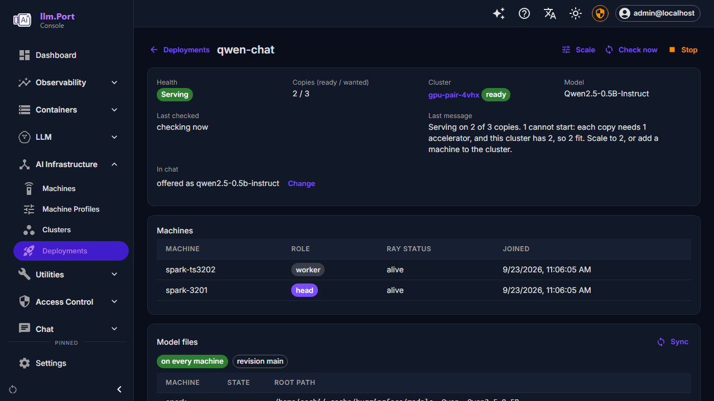
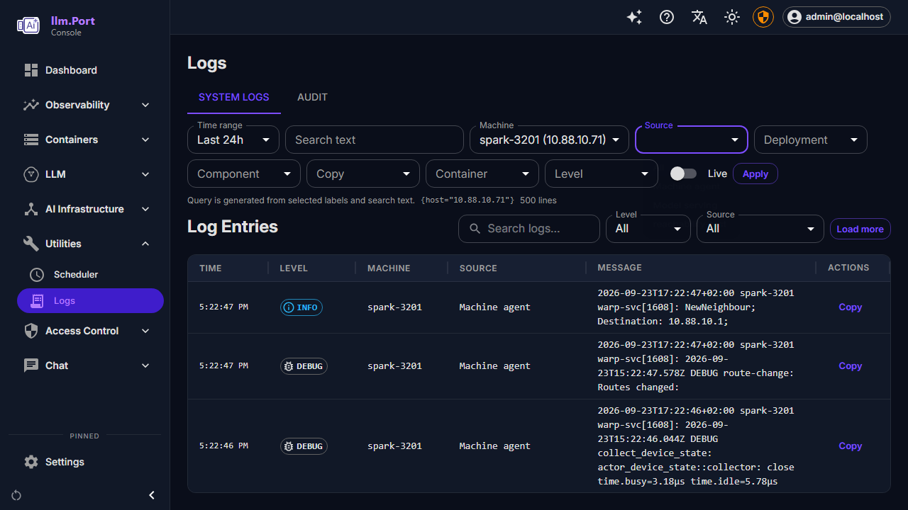

# Machines, clusters and deployments: FAQ

Questions that came up adding real machines. The full walk-through is
[Adding a machine and serving a model on it](onboarding-a-node.md). This page
covers what goes wrong along the way and what to do about it.

---

## Adding a machine

### I ran the install line. How do I know it asked to join?

The machine prints a short code and waits. In the console, **Machines** gets a
badge with the number waiting, and the Machines page names each machine and
the code it showed. Press **Review** to approve it.

If the *AI Infrastructure* group is collapsed you cannot see the badge, so
the group's icon gets a dot instead:



A request expires if nobody approves it in time. If the machine gave up
waiting, run the same line again for a new code.

### The installer asks for a sudo password I do not have.

Leave `sudo` out of the line:

```bash
curl -fsSLO http://<llm-port>:8000/api/install/llmport-agent.sh && sh llmport-agent.sh --join http://<llm-port>:8000
```

Run as yourself, the script installs the agent in `~/.local/bin` and runs it
as a **systemd user service**. Nothing asks for a password. The machine still
needs Docker (or Podman) that your user can use, since that is how the agent
runs the runtime.

### Will a user service keep running after I log out, or after a reboot?

Yes, if *linger* is on for your user. The installer turns it on. On DGX OS a
user may do that for themselves. Where a machine does not allow it, the
installer says so:

```
  NOTE: could not enable linger for sachi, so the agent stops when
  you log out. An administrator can fix that once with:
      sudo loginctl enable-linger sachi
```

Without linger the agent stops when your last session ends, and the machine
goes **offline** in the console.

### How do I upgrade the agent?

Run the same install line again. The machine is already a member, so the
installer skips the join, puts the new build in place and restarts the
service. There is nothing to approve:

```
  Already a member
  This machine is 'spark-3201' on http://10.88.10.220:8000; nothing to approve.
```

Deleting a machine in **Machines** revokes its membership. For that machine
the same line asks to join again, as it did the first time.

### The Add a machine panel lists several addresses. Which one do I use?

Use the one the machine can reach. A workstation running LLM.Port usually has
several: Wi-Fi, a VPN, Docker and VM bridges. Each is listed with its
interface name. Pick the one on the network you share with the machine, and
the command updates to use it. The panel never offers `localhost` or
`127.0.0.1`, because on the machine you are adding those point back at the
machine itself.

### The console says "Machines", but the API and the agent say "node".

They are the same thing. The console was renamed for people. The API, the
URLs (`/admin/nodes`) and the agent's own messages still say *node*.

---

## Clusters

### My cluster says it is restarting itself.

Part of it stopped: Ray on the head, or a worker dropped out. LLM.Port
checks every cluster once a minute, and when it finds one broken it looks a
second time before it restarts anything. It re-forms a lost head and rejoins a
lost worker, then applies the models again. You do not have to do anything.
[When something fails](resilience.md) lists each failure and what you will
see.

### My cluster failed to start. What now?

The cluster page says why, in the words the machine used, and gives you
**Try again**:



Fix the cause, then press **Try again**. If the cause is temporary, such as a
machine that was briefly unreachable or a dropped connection, you do not have
to press anything. The cluster retries on its own, waiting a little longer
after each failure, up to half an hour between attempts.

### It stopped retrying. It says it is waiting for the cause to change.

Some failures come out the same every time, so retrying them in a loop only
fills the logs. The main one: the server holds a different build of the
runtime image from the one the cluster is pinned to. For those the cluster
waits, and checks again about once an hour. It tries again straight away if
something changes that could give a different result: you edit the cluster,
a rebuilt runtime image is catalogued for one of its machines, or you press
**Try again**.

### The runtime image copy was interrupted. Does it start from zero?

No. The download resumes from where it stopped: the agent keeps the partial
file and asks the server only for the rest. The page shows a bar per machine
with how much has arrived, the rate, and how long is left, and the agent's log
shows the same as a text bar.

### Why did only one machine download the image from the server?

That is on purpose. The server sends the image **once**. The first machine
that has it serves it to the others over the cluster's own fast network. On a
pair of DGX Sparks that is the 200 Gb/s RoCE link, not the server's Wi-Fi.
While that happens the page shows one machine *serving* and the other
*receiving*:



If a machine cannot get the image from its peer, it falls back to the server
without you doing anything. The peer serves only this one image, only to
machines that hold a per-cluster token, and only while the transfer lasts.

### I switched the machines off. Now I cannot delete the cluster.

Press **Delete** on the cluster's page. Normally that stops the cluster first
and then removes it. When none of the cluster's machines is reachable, there
is nothing left to stop. The page tells you, and deletes the cluster anyway.

### A machine I stopped still shows healthy.

It should go **offline** as soon as its agent stops. The server marks a
machine offline the moment its connection closes. A machine that goes quiet
without closing it, such as one that lost power, is marked offline after five
minutes of silence. If it stays healthy longer than that, the agent is still
running somewhere. Run `pgrep -af llmport-agent` on the machine. An agent
started by hand with `llmport-agent run` is not a service, and removing the
service does not stop it.

---

## Deployments

### The model picker lists the same model twice.

Earlier versions made a new record every time a model was downloaded, so the
same repository could be listed more than once. The picker now shows what
tells the entries apart: the repository and the date each one was added. It
also leaves out any download that failed, since that one has no files to
deploy:



Pick the newest. Downloading a repository that is already there now returns
the existing model, and does not add another record. A failed download is
retried in place.

### My deployment is serving, but it is not in chat.

A deployment is offered in chat only under a name someone chose for it.
LLM.Port never makes one up. The deploy dialog now proposes one (**Offer in
chat as**), but a deployment made before that, or with the field cleared,
serves only at its endpoint. Its page says so:



Press **Offer in chat**, keep or change the proposed name, and save. The model
keeps running. Only its publication changes, and it appears in chat within a
minute or two:



Two deployments given the same name share it. Chat sends each request to
whichever of them is healthy.

### The deployment page said "syncing" after the model was already serving.

Fixed. The page used to read the model files, the machines and the endpoints
once, when it opened. A deployment opened while its model was still copying
went on showing "syncing" next to a health of **Serving**. The page now
re-reads them while the deployment comes up and each time its phase changes.
Pressing Scale, Stop or Save also no longer blanks the cluster, machines and
model files.

### How many copies can a deployment have?

As many as the cluster has accelerators for. Each copy uses the accelerators
the deployment asked for (one by default). A pair of DGX Sparks has two, so
two copies of a one-accelerator model, one on each machine. The **Scale**
dialog works this out and warns past it:



Asked for more anyway, the copies that fit start and serve, and the page
says why the rest cannot:



Scale back down, or add a machine to the cluster.

### Does scaling interrupt the model?

No. The copies already running are not restarted: the deployment stays
**Serving** while copies are added or removed, and the page says what is
left ("Serving on 1 of 2 copies; 1 more starting"). Adding a copy on the DGX
pair took about two minutes, removing one about twelve seconds.

### The deployment page does not say which machine each copy is on.

It shows how many copies are ready, not where they are. Ray reports copy
counts per deployment, not placement. On a pair of DGX Sparks with one
accelerator each, two one-accelerator copies are necessarily one per machine.

### The deployment says it is downloading the model to the LLM.Port server.

The model was not on the server yet. A cluster that cannot reach the internet
gets its models from the LLM.Port server, so the server downloads the model
first. The deployment waits for that and then copies the model to the
machines, and the page shows the download's progress. If the server's
download fails (for example a gated model without a token, or a mistyped
repository), the deployment shows the reason and waits. Retry the download
from **Models**, and the deployment picks it up once the model is there.

### The deployment reaches "Starting" and then fails.

Read the message on the deployment page. It carries the engine's own reason.
Most often the model does not fit in the GPU's memory, or it needs a number
format the card does not support.

---

## Logs

### Where do I see one machine's logs?

On the machine's page, press **Open in Logs**. It opens **Logs** with that
machine already chosen. On the Logs page itself, pick it under **Machine**:
machines are listed by name, with the address LLM.Port knows them by.



The filters come from the logs themselves, so they only offer what the chosen
time range contains. Choosing one narrows the others. With a machine chosen,
**Source** offers only what that machine sent.

### What do the sources mean?

| Source | What it is |
|---|---|
| System log | The machine's own system journal: every service on it, not only LLM.Port |
| Model serving | The model's copies on the cluster. **Deployment** and **Component** narrow it to one deployment, and to its model server or its API entry |
| LLM.Port services | The containers of LLM.Port itself, on the server |
| Model containers | Models run the older way, one container per model |

### A machine's logs are missing.

A machine asks LLM.Port where to send its logs when its agent starts. For the
logs to arrive, the machine must be able to reach LLM.Port's log store
(Loki) on port 3100:

- In development, set `LOKI_BIND=0.0.0.0` in `llm_port_shared/.env` and
  restart the shared stack. By default Loki listens only on the server itself.
- Where Loki lives on another host or behind another name, set
  `LLM_PORT_BACKEND_AGENT_LOKI_URL` on the backend to an address the machines
  can reach.

Machines installed with the one-line install before agent 0.1.10 sent no logs
at all. Run the same install line again to upgrade them.

### I sent a request but see no log line for it.

The model's copies write log lines when something happens (starting,
stopping, an error), not for every request. Ray records each request in its
proxy log, which is not sent to LLM.Port.
