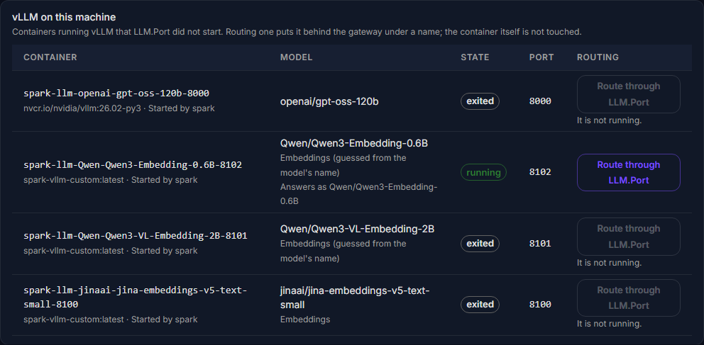
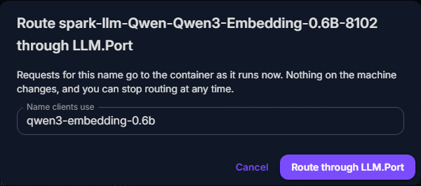
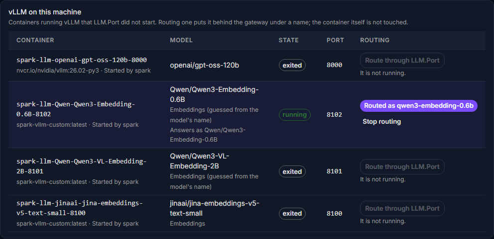
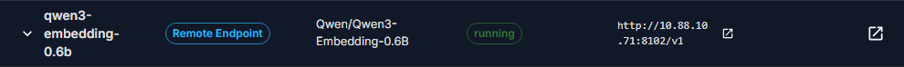
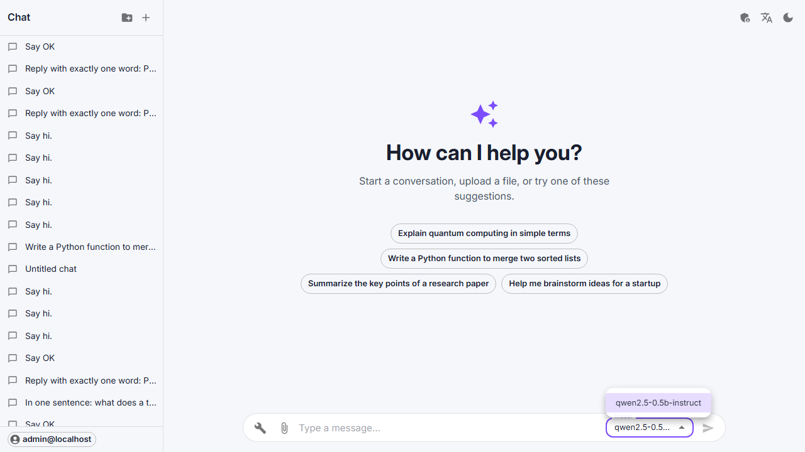

# vLLM you already run

Most machines already run some vLLM before LLM.Port arrives: containers
started by hand, or by another tool. The three machines this project uses had
eleven between them. LLM.Port finds them and lets you put any running one
behind its gateway, under a name, without touching the container.

Found and routed on the DGX pair on 2026-09-23: spark_manager's
`Qwen3-Embedding-0.6B` container on spark-3201, answering `/v1/embeddings`
through the gateway in 0.8 s.

---

## What is found

Every machine with agent **0.1.11 or later** reports, about once a minute, the
vLLM containers LLM.Port did not start: running or stopped, whatever started
them. Each machine's page lists them under **vLLM on this machine**:

For each one:

| Column | What it shows |
|---|---|
| Container | Its name, image, and the tool that started it, from the container's labels ("Started by spark", or a Docker Compose project) |
| Model | The model, what it is for (chat, embeddings or scoring), and, when it runs, the name it answers to |
| State | Running or stopped |
| Port | The port it is published on at the machine |

The kind of model comes from its flags (`--task embed`). When the flags say
nothing, it is guessed from the model's name and marked "guessed".

**Finding is read-only.** The agent reads the container list and each
container's configuration, and nothing else. Two things never leave the
machine:

- **environment variables**, where `HF_TOKEN` and the like live;
- **secret values** in the command line: `--api-key sk-...` is reported as
  `--api-key ***`, and the same goes for any flag with key, token, secret or
  password in its name.

Containers LLM.Port started itself (`llm-port-*`) are not listed; they are
already on the Providers and Deployments pages.

## Routing one as it is

Press **Route through LLM.Port** and give it the name clients will use. The
suggestion is the name the container answers to.

Requests for that name then go to the container, as it runs now:

It appears on the Providers page, owned by the container. Its row links to the
machine's page, which is where it is managed.

Nothing on the machine changes: not the container, its settings or its
restart policy. It stays whoever's it was: spark_manager still starts and
stops the spark containers.

**Stop routing** takes the name away again (the gateway then answers 404 for
it). The container keeps running.

### When it stops

A routed container that stops is taken out of routing within about a minute.
It is put back when it runs again. Requests for its name fail in between, as
they would have without LLM.Port.

### What cannot be routed, and why

The button is greyed out, with the reason below it, for a container that:

| Reason shown | Why |
|---|---|
| It is not running. | There is nothing to send requests to. Start it the way it is normally started. |
| Its port is not published on the machine | Only other containers on that machine could reach it. |
| It serves scoring (rerank) requests | The gateway serves chat and embeddings. It has no route for rerank requests yet. |
| It asks for an API key | A key is not handled yet. Routing would need LLM.Port to store it, and keys for remote providers are still stored unencrypted. |
| No answer from ... | LLM.Port asked it `GET /v1/models` and got no answer: it is still loading, or a firewall is in the way. |

## Several kinds of model behind one gateway

Routing a found embedding model put a second kind of model behind the gateway,
next to the chat model served by the cluster. Every route now says what it is
for (`chat`, `embeddings` or `scoring`):

- Cluster deployments say `chat`.
- Single-machine runtimes take it from their vLLM flags (`--task embed` means
  embeddings), and say `chat` otherwise.
- A found container says what its flags say, or what its model's name suggests.
- Only a remote API, which LLM.Port cannot look inside, says nothing.

What that gives you:

- **The model list says it.** `GET /v1/models` returns a `kind` with each model.
- **The chat page offers chat models only.** It used to list the embedding
  model too, and choosing it failed on the first message.

  

- **A request of the wrong kind is refused at once.** A chat request to an
  embedding model gets a 400 that says where to send it instead:
  "qwen3-embedding-0.6b is an embeddings model: send it to /v1/embeddings".
  It is not sent to the model first.

Checked on the DGX pair with 40 requests at once, half chat and half
embeddings. All 40 answered, and each came back from the model it was meant
for. A streaming chat ran alongside the embeddings without trouble.

### Found and fixed on the way

| What | Effect | Fix |
|---|---|---|
| `/v1/embeddings` went through the chat path | No embedding model could be reached through the gateway ("does not support Chat Completions API"). Its test had been written the same way and passed | Embeddings go to the embeddings API |
| Capacity slots leaked | A request that ran past its 90 s lease never gave its slot back. The chat model had lost 8 of its 16 slots, and 22 of 30 requests sent at once were refused while nothing else was running | Slots expire with their lease, so they cannot leak |
| A burst was refused at once | When every slot was busy, the request failed right away | It waits up to 30 s for a free slot (`capacity_wait_sec`) |
| Embeddings sent to a chat model | 502, a server error | 400, the caller's mistake |

The first burst after the gateway starts takes a few seconds longer than later
ones (3.1 s against 0.9 s for 40 requests). The gateway sets up its connection
to each model on the first requests it sends there. Setting them up when a
route is added would remove that.

## Next

- **Move it into a cluster.** Its flags become a cluster deployment. That is
  checked with a real request, then the name moves over with no gap, and it
  can be switched back.
- **Retire it.** Stop the old container, only when you confirm it, and never
  one another tool manages.
