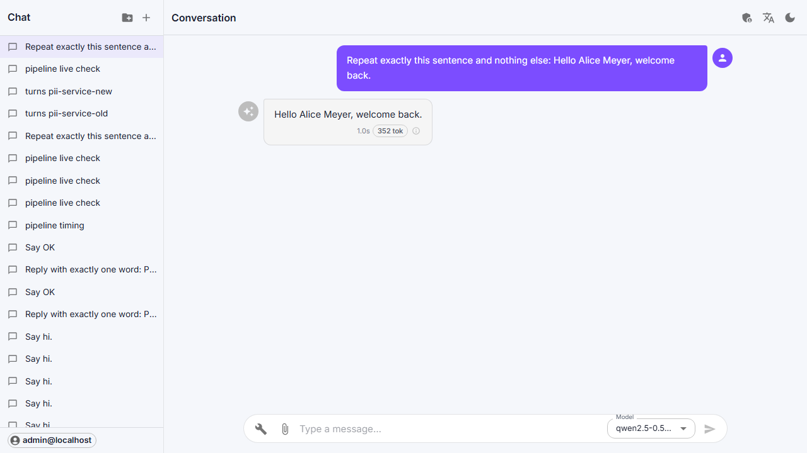

# What the gateway does with a chat request

A chat request passes through up to eight steps before it reaches the
model: limits, routing, RAG, the session's history, skills, PII, tools and
the model slot. Each step had tests of its own. Run together, which is how
the chat page uses them, they had bugs no single test could see, and PII
made every chat close to a second slower.

Checked on the workstation on 2026-09-23 with every module running (PII,
RAG Lite, skills, MCP), a chat session, and the `qwen-chat` deployment on
the DGX pair.

---

## The order

| # | Step | What it does |
|---|---|---|
| 1 | Limits and routing | Checks rate limits, finds the routes for the model name, and refuses a request of the wrong kind (a chat request to an embedding model) |
| 2 | Four lookups, side by side | **RAG** searches RAG Lite for context, as the user who asked. **Session** loads the chat's history, memory and attachments, and saves the new user message. **Skills** finds the skills that apply. **Tools** fetches the MCP tool list |
| 3 | Assembly | The retrieved context and the skills are added as system messages, to this request only, so they never become history |
| 4 | PII | Scans everything that is about to leave: the message, the history, the retrieved context |
| 5 | Model slot | Taken only now, when nothing else is left to wait for |

The four lookups do not depend on one another. They used to run one after
another; now the request waits for the slowest of them, usually RAG, not
for their sum.

The model slot is taken last. It used to be taken first and held while RAG,
the session and the PII scans ran, so the model sat idle, reserved for a
request that was still gathering its context.

After the answer, the slot is given back first. Then the answer comes back
through PII (tokens back to names, streamed or whole), is saved to the
session, and is written to the audit log. Recording which skills were used is
done in the background: nothing waits for it.

One request, in milliseconds from its start, with every module on:

| Step | Starts | Takes |
|---|---|---|
| Limits, routing | 0 | 7 |
| RAG | 7 | 49 |
| Session | 7 | 18 |
| Skills | 8 | 18 |
| MCP tool list | 8 | 18 |
| PII | 58 | 18 |
| Model slot, then the model | 76 | |

## PII

With PII in tokenize mode, a name leaves as a token and comes back as the
name:

| | What it contains |
|---|---|
| Sent to the model | `I am [PERSON_1]` |
| Shown in chat, and saved to the session | `I am Alice Meyer` |
| Kept in the trace | `I am <PERSON>` |



The chat page always streams. Tokens are put back as the answer streams,
including a token that arrives split across two pieces (`[PER`, then
`SON_1]`): text that may be the start of one waits until the rest arrives.

Retrieved context is scanned too. "Munich" in a RAG document leaves as
`[LOCATION_1]`, and the answer still says Munich.

**What PII costs.** Text is scanned once per request, and the trace's copy
is made from that scan. The PII service remembers the result for each piece of
text it has seen, keyed by a hash of the text and the scan settings. It keeps
entity types and positions, never the text. So a chat's history is not
scanned again on every turn: only the new message is.

| On a 10-turn chat | Before | After |
|---|---|---|
| PII scans per request | 2 | 1 |
| PII time per turn | 162 ms, growing to 444 ms by turn 10 | 20–40 ms, flat |
| Time the gateway adds per turn | 345–591 ms | about 100 ms |

The model's own time is not in these figures. Of the 100 ms, about half is
the RAG search itself: embedding the question and searching the vectors.

## Found and fixed

| What | Effect | Fix |
|---|---|---|
| A streamed answer kept the tokens | The chat page showed "Hello [PERSON_1]". The streaming path dropped the token mapping | Streamed and whole answers share one path; tokens are restored as the answer streams |
| The streamed answer was saved with the tokens | The history said "[PERSON_1]", and the next turn sent it to the model like that | The answer is saved as the user saw it |
| Retrieved context was saved as chat history | Each turn's RAG results became a system message in the history, sent again on every later turn and scanned by PII each time. This is what made PII look like 874 ms | Context is added after the session step, to this request only |
| History over its token budget kept the oldest turns | The newest turns, the ones the question follows from, were dropped | The newest turns that fit are kept |
| RAG Lite search was called without a token | Every search was refused (401), and the answer went out without its context. Only the gateway's log said so | The search runs as the user who asked |
| The gateway ignored the RAG Lite switch | Switching RAG Lite on in Modules did nothing for chat | The gateway reads the switch at startup |
| Skills were never used | The gateway's list of modules did not include skills, so no skill reached a chat | Skills is on the list |
| Publishing a skill failed | Publish returned 500 and nothing was published | Fixed in the skills service |
| Assigning a skill failed | The skills service expected `/assign`; the backend sends `/assignments` (405) | The skills service takes `/assignments` |
| The model was told the wrong placeholders | In redact mode it was told to expect `[REDACTED_PERSON]`; PII writes `<PERSON>` | The instructions name what PII writes |
| The first chat after PII started was slow | spaCy finished loading on the first request (~0.9 s) | PII warms up when it starts |

## Every module in the dev environment

```
llmport dev up --modules pii,mcp,skills
```

runs PII, MCP and skills on the host next to the backend and gateway, on
127.0.0.1, and points the gateway and backend at them:

| Module | Address |
|---|---|
| PII | http://127.0.0.1:8003 |
| MCP | http://127.0.0.1:8007 |
| Skills | http://127.0.0.1:8008 |

Without `--modules`, the modules switched on with `llmport module enable`
run. A module that is not started is switched off in the gateway and
backend, so no request is sent to a port nothing listens on.

- The first start downloads PII's spaCy model (about 400 MB).
- PII runs on Python 3.13. spaCy does not load on 3.14.
- In dev, do not press **Enable** for PII, MCP or skills on the Modules page.
  It starts their containers, which the host-run gateway cannot reach.
  RAG Lite has no container: enable it there.

## What is left

- The routing lookups (policy, routes) go to the database on every request:
  about 6 ms. Kept in memory they would save that, at the cost of a route
  change taking effect a few seconds late. Not done: too little to gain.
- The audit row is written before a streamed response ends, about 3 ms
  after the last chunk. It is kept that way: the audit log is a record, and
  a background write could be lost.
