# Adding a machine and serving a model on it

End to end: a bare Linux machine with a GPU becomes a member of a cluster and
serves a model through an OpenAI-compatible endpoint.

Everything here is done from the LLM.Port console except two commands you run
on the machine itself. You never need a shell on it again afterwards.

> **A note on names.** The console calls these **machines** throughout —
> *AI Infrastructure → Machines*, *Add a machine*, *Machine Profiles*. The
> API, the URLs (`/admin/nodes`) and the agent still say *node*; it is the
> same thing.

Roughly 30 minutes, most of it waiting for a model to copy.

---

## Before you start

**On the machine you are adding:**

| | |
|---|---|
| OS | Linux, x86_64 or aarch64 |
| Container runtime | Docker or Podman, running, and your user can use it |
| GPU | NVIDIA, with a working driver — check `nvidia-smi` prints your card |
| Network | Able to reach the LLM.Port server. The server does **not** need to reach it |
| Disk | ~20 GB for the runtime image, plus room for your models |

**On the LLM.Port server:** you are signed in as an administrator, and you
know its address as the machine will see it — `http://10.88.10.220:8000`, not
`localhost`.

> **Check the GPU first.** If `nvidia-smi` does not print your card, stop and
> fix that. A machine that cannot see its GPU will still join, and will then be
> refused when you try to put it in a cluster — with a message about its
> platform that is true and unhelpful.

---

## Step 1 — Install the agent on the machine

In LLM.Port, open **AI Infrastructure → Machines** and press **Add a machine**.
The panel gives you one line to paste on the machine:

```bash
curl -fsSLO http://10.88.10.220:8000/api/install/llmport-agent.sh && sudo sh llmport-agent.sh --join http://10.88.10.220:8000
```

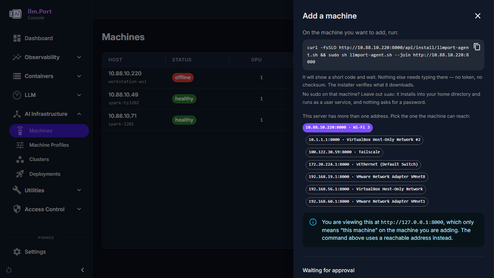

The address in it is one the machine can reach, not the one your browser is
on. This server usually has several — Wi-Fi, a VPN, Docker and VM bridges —
and only you know which the machine shares; the panel lists them with the
interface each belongs to, and never offers one that only means "this
machine". Pick the right one before copying.

That line is the whole install. The script is generated by your LLM.Port, so
it already knows the address, which build fits this machine, and what that
build should hash to. It downloads the agent, checks the digest, installs it,
and asks to join:

```
  Machine:  linux-aarch64
  LLM.Port: http://10.88.10.220:8000

  Downloading the agent...
  Checking it is the build this backend expects...
  Verified.
  Installed /usr/local/bin/llmport-agent

      Code:  7LG-3P7
  Open LLM.Port in a browser and approve this
```

Back in LLM.Port, **Machines** now shows a badge with the number waiting, and
the page says which machines they are and the code each one showed:

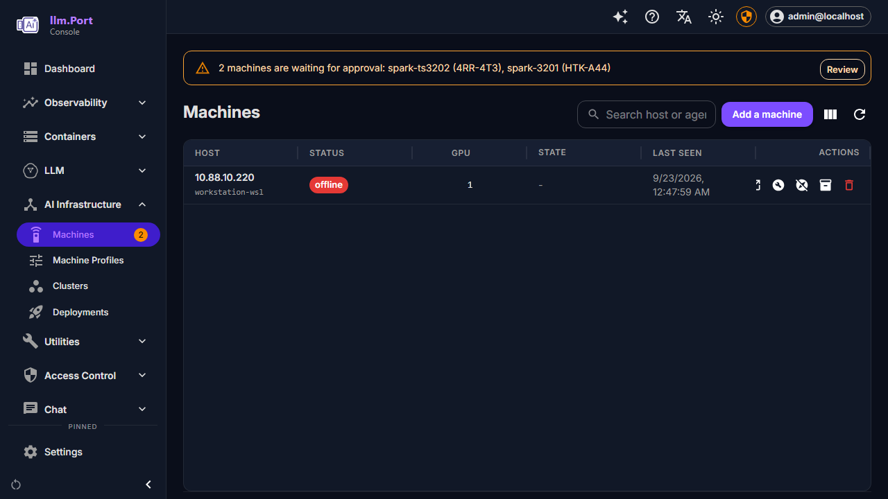

Press **Review**, check the code matches the one on the machine, and approve.

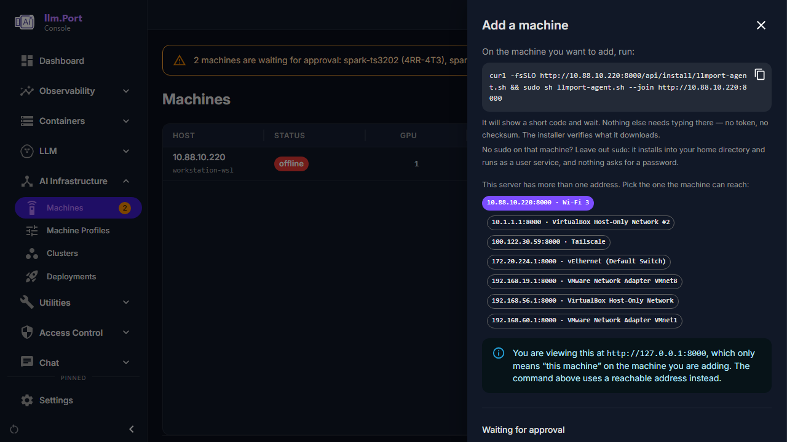

It goes **healthy** in the list.

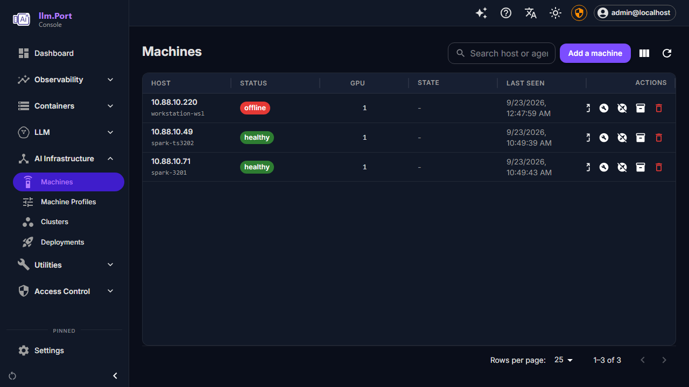

It is deliberately not `curl … | sh`: the script lands on disk first, so you
can read it before it runs, and it verifies what it downloads. The `&&` only
chains the download to the run.

### Without sudo

Leave `sudo` out:

```bash
curl -fsSLO http://10.88.10.220:8000/api/install/llmport-agent.sh && sh llmport-agent.sh --join http://10.88.10.220:8000
```

Run as yourself, without passwordless sudo, the script installs the agent into
`~/.local/bin` and runs it as a **systemd user service** — nothing asks for a
password at any point. It enables *linger* for your user so the service keeps
running after you log out and starts again after a reboot. On DGX OS a user
may do that for themselves; where a machine does not allow it, the script
says so and names the one command an administrator needs to run.

### Upgrading the agent

Run the same line again. The script installs the new build over the old one,
sees that this machine is already a member, and restarts the service on the
new build. There is nothing to approve a second time.

A machine you deleted from **Machines** is no longer a member, so for that
one the same line asks to join again, as it did the first time.

### If the machine has no internet

Nothing changes — run the same line. The script tries the published release
first and falls back to LLM.Port's own copy, which the machine can reach,
since it is the one it is joining:

```
  Downloading the agent...
  Could not reach https://github.com/llm-port/...
  Falling back to LLM.Port's own copy...
  Checking it is the build this backend expects...
  Verified.
```

The digest comes from your LLM.Port either way, so the check is identical.

### Skipping the approval step

In **Add a machine**, press **Skip the approval step** and create a token. The
line it gives you carries a single-use token, so the machine joins on its own
with nothing to approve — for when you can paste into the machine, and for
Ansible, cloud-init or an image build where nobody is at a browser.

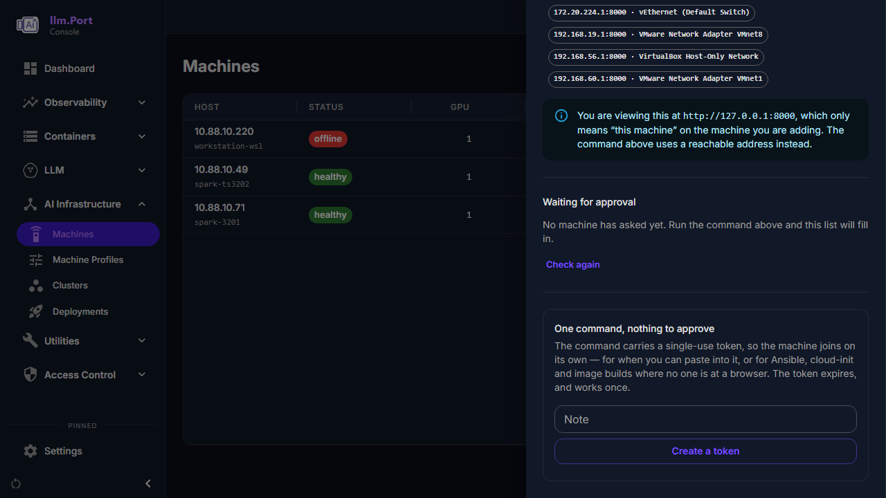

### If your deployment carries no agent build

The installer asks the server which build to fetch. A deployment that has
published none, and cannot reach the release either, stops with:

```
ERROR: this backend publishes no agent build for linux-x86_64.
```

Build one with `llm_port_node_agent/build-binary.sh`. Running from a source
checkout, that is all there is to it — the backend serves the build output
directly, so there is nothing to copy anywhere. Add `--remote user@host` to
build an architecture this machine cannot, such as aarch64 from an x86_64
workstation:

```bash
cd llm_port_node_agent
sh build-binary.sh linux-aarch64 --remote sachi@10.88.10.49      --ssh-key ~/.ssh/id_dgx_spark
```

On a real deployment, which has no checkout, put the built file wherever
`agent_binary_dir` points. Or install from source on the machine, and use
the agent's own setup commands — you still write no configuration by hand.

```bash
sudo apt-get update && sudo apt-get install -y python3 python3-venv
sudo python3 -m venv /opt/llmport/venv
sudo /opt/llmport/venv/bin/pip install /path/to/llm_port_node_agent
sudo ln -s /opt/llmport/venv/bin/llmport-agent /usr/local/bin/llmport-agent
```

Run `llmport-agent` with no arguments and it offers a menu — Configure, Init,
Run, Start. Or drive it directly:

```bash
sudo llmport-agent init        # one-time host setup
llmport-agent configure        # guided; writes the config for you
```

`configure` asks a short list of questions, each with a sensible default:

| It asks | Answer |
|---|---|
| Backend URL | The LLM.Port address **as this machine sees it** |
| Enrollment token | Paste one from **Add a machine**, or leave blank to join by approval |
| Agent ID | A name for this machine; defaults to its hostname |
| Advertise host | The address other machines reach it on — see below |
| Model store | It detects your HuggingFace caches and lists them with model counts |
| Loki URL | Defaults to the LLM.Port host; blank disables log forwarding |

It shows you everything before saving.

> **Advertise host is the one worth thinking about.** It must be an address
> other machines can reach — the LAN address, not a loopback and not a
> container bridge. It becomes the address the cluster is built on, so a wrong
> answer here produces a cluster that cannot start, with an error about
> binding an address.

Everything else — where Ray keeps its session, where the cluster token goes —
has a working default and is not asked.

Then `llmport-agent join` and approve it, exactly as above — or, if you gave
`configure` an enrollment token, `sudo llmport-agent start` instead, with
nothing to approve.

### Confirm before moving on

The machine should be listed **healthy**, and its detail page should show your
GPU. If it shows no accelerator, see *Troubleshooting*.

On the machine itself, `llmport-agent status` reports the service and
`llmport-agent show` prints the configuration it is actually using.

### The agent's commands

Run `llmport-agent` with no arguments for a menu, or name one directly:

| Command | What it does |
|---|---|
| `configure` | Guided setup. `configure --set KEY=VALUE` to change one thing |
| `show` | Print the configuration in use |
| `init` | One-time host setup; needs `sudo` |
| `join [url]` | Ask to join, and wait for approval |
| `start` / `stop` | Install and run as a service, or remove it |
| `status` | Is the service running |
| `run` | Run in the foreground — useful when something is wrong |
| `scan` | List the models already in this machine's cache |

---

## Step 2 — Create a cluster

**AI Infrastructure → Clusters** → **Create a cluster**.

1. **Name it.** Anything; `gpu-box-01` is fine for a single machine.

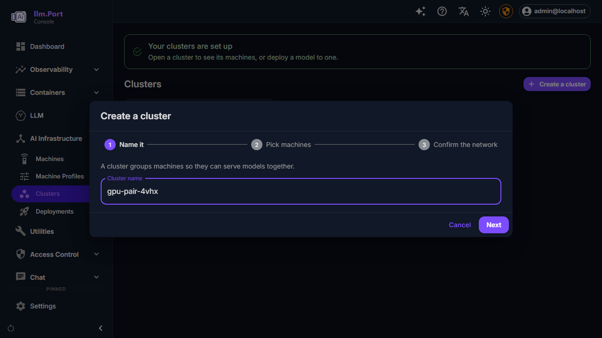

2. **Pick the machines.** For each one picked, the wizard tells you which
   runtime image it will run — "gpu-box-01 runs NVIDIA x86_64 Runtime". You do
   not choose the image: it follows from the machine's CPU architecture and
   accelerator.
3. **Choose which machine leads** (only asked when you picked more than one).

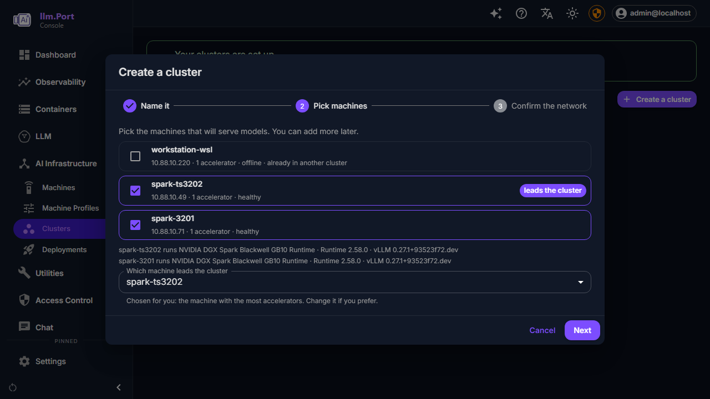

> If a machine you picked shows **"No certified runtime image runs on …"**,
> remove it. There is no image built for its platform, and the cluster cannot
> start it. The message names the reason.

### Ports

The cluster uses port **6379** for Ray's head, **8265** for its dashboard and
**8000** for serving. If anything on the machine already uses one of those —
Redis on 6379 is the common one — set different ports when you create the
cluster.

Getting this wrong is not subtle: the cluster fails to start and the reason is
a Ray backtrace ending in `Address already in use`.

---

## Step 3 — Choose the network

Open the cluster and apply its plan. LLM.Port inspects every machine's
interfaces and proposes how they should talk to each other.

**Check what it chose.** It prefers a dedicated, isolated link — which is
right for a 200 Gb/s RoCE fabric between two DGX machines, and wrong if the
machine happens to have a VPN interface, because a VPN address looks isolated
too. If the proposed address is not the one you expect the cluster to run on,
pick the correct network explicitly before applying.

For a single machine this matters less, but the address still becomes the
cluster's own address, so it is worth a glance.

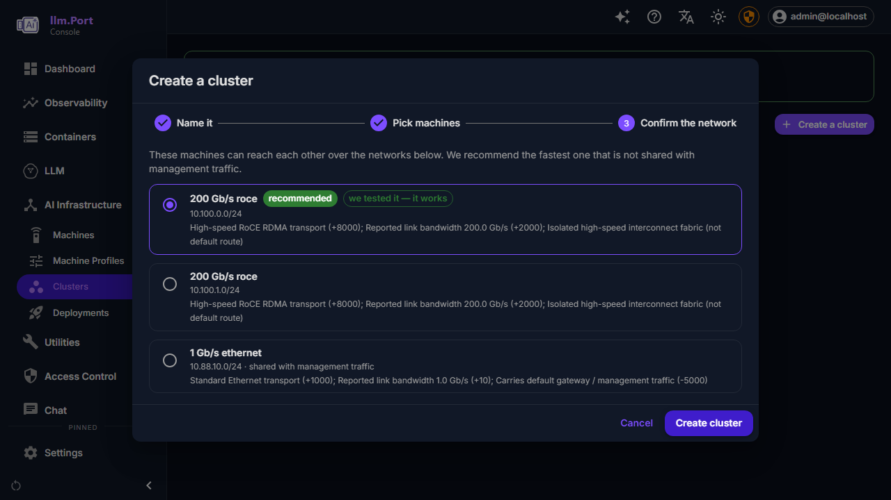

Each option says why it scored as it did — link speed, whether it is a
dedicated fabric, and whether it also carries management traffic. The one
carrying your default gateway is marked as shared and ranked below the rest.

---

## Step 4 — Watch it come up

There is nothing to press: creating the cluster starts it. The cluster page
opens on **Starting**, and from there it will:

1. get the runtime image onto every machine and verify it (about 12 GB the
   first time),
2. install the Ray runtime inside it,
3. start the head, and join any other machines,
4. probe the cluster and report what it found.

The first step is the long one, and the page shows it as it happens — a bar
per machine with the percentage, how much has arrived, the rate, and roughly
how long is left:


The image comes from the LLM.Port server, never from a registry, so this works
on machines with no internet. It comes from the server **once**: the first
machine fetches it, and every other machine gets it from that one over the
fast network the cluster was built on — on a pair of DGX Sparks, 200 Gb/s
RoCE rather than the server's own link. Above, `spark-ts3202` already has the
image and is serving it to `spark-3201` over the RoCE address `10.100.0.1`.
If a machine cannot be served by its peer for any reason, it falls back to the
server by itself. A dropped connection resumes where it stopped rather than
starting over.

The cluster reaches **Running**, with every machine up and its accelerators
counted, and the page offers the next step:

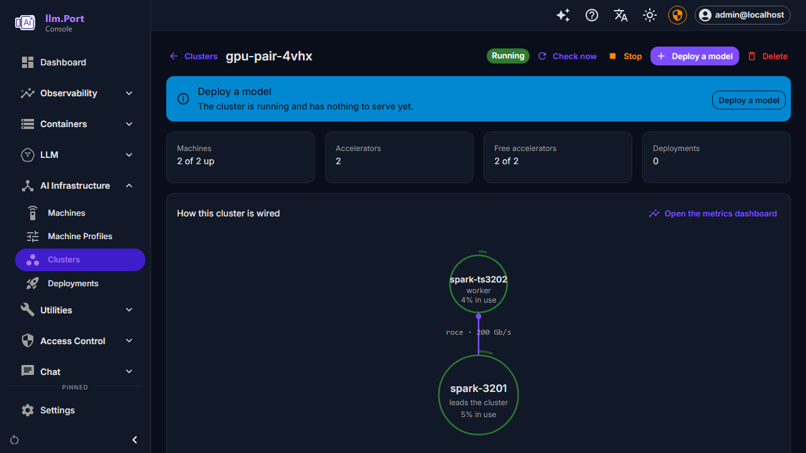

If the totals are lower than you expect, a machine did not join — open it and
read its status.

### If it cannot start

The page says why, in the words the machine used — "this server holds a
different build of the runtime image than the machine was asked to run", say —
not a generic "machines are not reporting". Something that cannot come out
differently on a retry is not retried on a loop; the page says it is waiting
for the cause to change. Fix it and press **Try again**.


---

## Step 5 — The model, on the server

A cluster's runtime cannot reach the internet — deliberately, so a machine's
contents stay predictable — so a model reaches the machines **from the
LLM.Port server**. You do not have to put it there first: deploy a model the
server does not have yet and the server downloads it, and the deployment
waits for it and says so:

```
Downloading Qwen/Qwen3-4B to the LLM.Port server (43%).
It is copied to the cluster as soon as it is there.
```

You can still download it ahead of time in **Models** — worth doing for a big
model you want ready before anyone deploys it. A model that was *imported*
rather than downloaded has no repository to fetch from, so that one does have
to be on the server first, and the deployment says so if it is not.

If the server's download fails — a gated model without a token, a mistyped
repository — the deployment shows the reason and waits. Retry the download
from **Models**; the deployment picks it up once the model is there.

---

## Step 6 — Deploy the model

Press **Deploy a model** on the cluster's page — or in **Deployments**, where
you also pick the cluster.

1. **Model** — pick the one you want. Choose a *chat* model if you want a chat
   endpoint; embedding and reranker models are served differently and will not
   give you one. A download that failed is not offered: it has nothing to
   deploy. One still downloading is, and says so.
2. **Cluster** — only asked in **Deployments**, and preselected there when
   there is exactly one.
3. **Name** — prefilled from the model; change it if you like.
4. **Offer in chat as** — the name people pick in chat and use at the API,
   prefilled from the model. Deployments of the same model on different
   clusters that share this name share the traffic. Clear it to serve the
   model by its endpoint only.

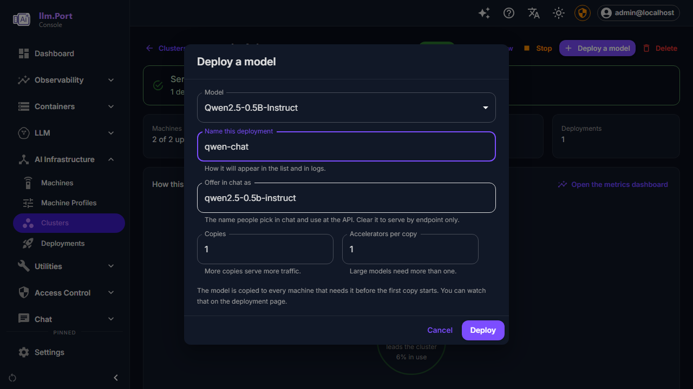

Deploy. The deployment page then walks through:

| It says | What is happening |
|---|---|
| Queued | Accepted, not started |
| Copying the model | The server is sending the model to each machine |
| Starting | The engine is loading the model onto the GPU |
| Serving | Ready |

**Copying** is the slow one — minutes, and proportional to the model. On the
DGX pair, Qwen2.5-0.5B-Instruct went from **Deploy** to **Serving** in a
little over three minutes, most of it the engine starting; the machines
already had the model from an earlier run, so its copy took seconds.
**Starting** is where a model too large for the GPU, or unsupported by it,
fails. Both report what went wrong on the deployment page rather than making
you read logs.

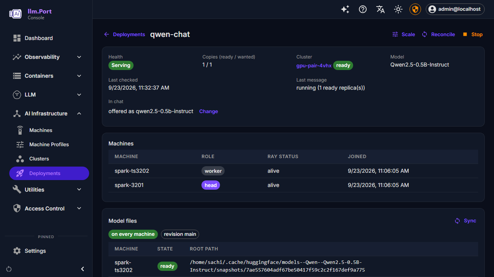

---

## Step 7 — Use it

A serving deployment is offered in chat under the name you gave it in
**Offer in chat as**, without wiring anything up. Try it there first: it is
the quickest confirmation that the whole path works. The prompt goes through
the gateway to the engine on the cluster, and the reply streams back.

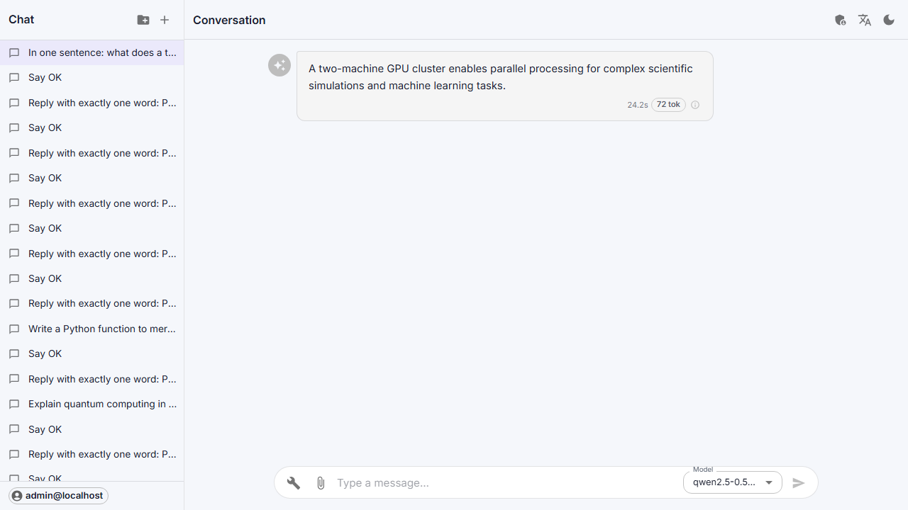

A deployment with no chat name serves only at its endpoint. Its page says
*In chat: not offered* and has **Offer in chat**, which sets the name without
restarting the model.

For the API, the deployment page shows the endpoint. It is OpenAI-compatible:

```bash
curl http://<cluster-address>:8000/<app>/v1/chat/completions \
  -H 'Content-Type: application/json' \
  -d '{"model":"<served model name>","messages":[{"role":"user","content":"hello"}]}'
```

---

## Taking it down

In **Deployments**, **Stop** a deployment to free the GPU while keeping the
configuration, or **Delete** it to remove it entirely. Deleting also removes
the provider it created, so it stops being offered in chat.

Stopping a deployment does not stop the cluster. Stop the cluster separately
if you want the machines idle.

### Removing a machine

Stop the agent on the machine first, then remove the node in the UI:

```bash
sudo llmport-agent stop
```

That stops the service *and* any agent running in the foreground. Both
matter: if you installed from source you may have started it by hand with
`llmport-agent run`, and that is not a service, so removing the unit does
not touch it.

Check nothing is left before you delete the node:

```bash
pgrep -af llmport-agent
```

Only then delete the machine in **Machines**. Removing it while the agent is
still running just lets it enrol again on its next heartbeat.

An agent installed without `sudo` runs as a user service, and stops without
it: `llmport-agent stop`.

### Deleting a cluster

**Delete** on the cluster's page stops it and then removes it. A cluster whose
machines are all gone — switched off, or their agents removed — cannot be
stopped, since nothing is left to ask; the page says so and deletes it
anyway, which is safe because nothing of it is running.

---

## Troubleshooting

**The machine joined but shows no GPU.**
The agent runs as a service, and a service has a smaller `PATH` than your
shell. If `nvidia-smi` works for you but the machine reports no accelerator,
the driver is somewhere the service cannot see. Check
`sudo systemctl show llmport-agent -p ExecStart` points at the agent you
installed (`systemctl --user show llmport-agent -p ExecStart` for one
installed without `sudo`), and that `nvidia-smi` is on a standard path.

**The cluster will not start: "Address already in use".**
Something on the machine already holds Ray's port. Change the cluster's ports
(Step 2). On a machine that also runs Redis, 6379 is always taken.

**A deployment sits on "Copying the model".**
The server has no copy to send. Finish the download in **Models** (Step 5).

**A deployment reaches "Starting" and then fails.**
Read the message on the deployment page — it carries the engine's own reason.
Most often the model does not fit in the GPU's memory, or needs a numeric
format the card does not support.

**I removed the agent, but the machine still shows healthy.**
An agent already running does not notice that its files are gone. It read
its configuration at startup and never looks again, so deleting the binary,
the unit and the config leaves it running, still streaming to the server,
and the machine stays green — indefinitely. Run `pgrep -af llmport-agent` on
the machine; if anything comes back, `sudo llmport-agent stop` will end it.

**A machine goes offline and its work sticks.**
Commands in flight when an agent stops are declared dead once they have been
silent for longer than their own budget, and the deployment then retries.
Restarting the agent is safe.

---

## Adding more machines later

Repeat Step 1 for each machine, then add them to an existing cluster, or build
a second cluster from them.

Two things decide whether machines can share a cluster:

- **They must reach each other.** Ray needs two-way connectivity on several
  ports. A machine behind NAT can run its own cluster but cannot join one.
- **A model runs on one kind of GPU at a time.** A single deployment cannot be
  split across, say, a Blackwell and a Turing card. Mixed machines can live in
  one cluster, but each model still lands on one kind.

If either is untrue, give the machine its own cluster. LLM.Port routes across
clusters, so a model on each is still one endpoint to your users.
